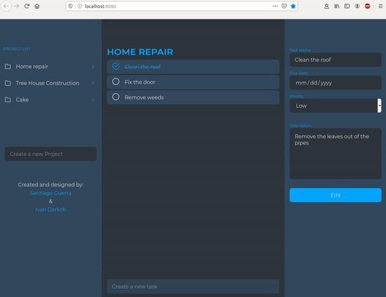
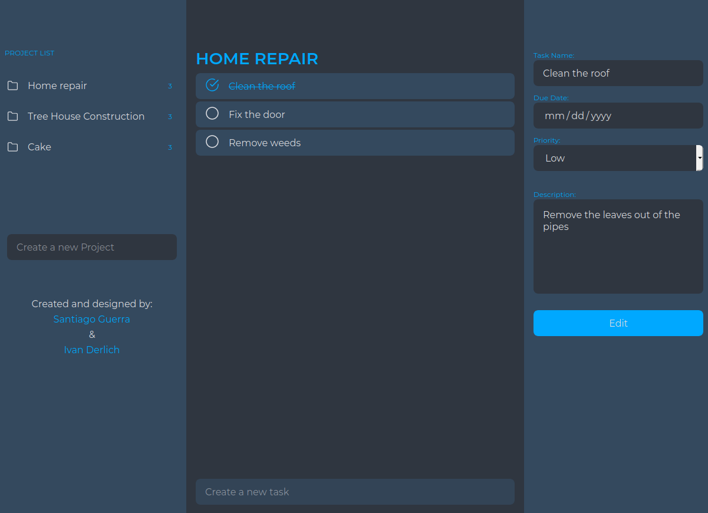
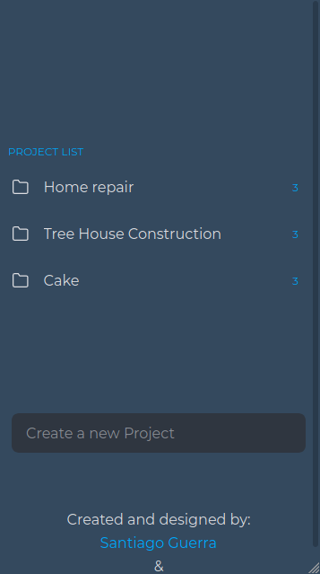
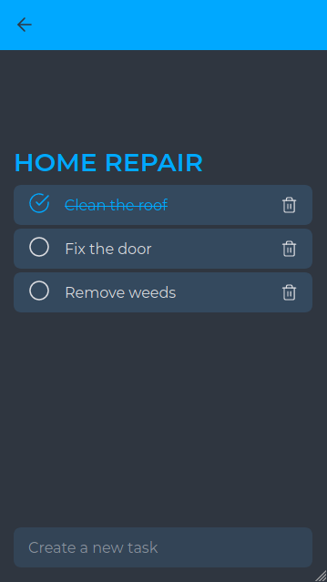
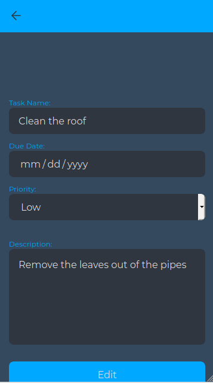

# Task Management Application

  Website app to manage projects and tasks. 

## Desktop Interface

## Mobile Interface

 
 
  

## Installation

Download the source code from GitHub:

    git clone https://github.com/IvanDerlich/to-do.git  
  
  Move to the directory of the downloaded folder:

    cd to-do
  
  Install the project's dependencies:

    npm install

  Build the project:

    npm run build

  If the previous command doesn't open the index.html file in your default browser, then open it manually. It's located in the 'dist' folder.
  

### Built With
This project was built using these technologies:
* JavaScript.
* Webpack.
* NPM.
* CSS/HTML.

<!-- LIVE VERSION -->
## Live version

[Here](https://ivanderlich.github.io/to-do).

## Interact

[Report Bug](https://github.com/IvanDerlich/to-do/issues).

[Request Feature](https://github.com/IvanDerlich/to-do/issues).

## Authors

[Ivan Derlich](https://www.ivanderlich.com).

[Santiago Guerra](https://github.com/SantiagoGuerra).

 
 

<!-- ACKNOWLEDGEMENTS -->
## Acknowledgments
* [Microverse](https://www.microverse.org/):   This project is part of the Microverse JavaScript curriculum! They checked our code in [this](https://github.com/SantiagoGuerra/to-do/pull/1) pull request.
* [The Odin Project](https://www.theodinproject.com/): They've provided Microverse with [this guide](https://www.theodinproject.com/courses/javascript/lessons/todo-list). Project title: Todo list.

<!-- MARKDOWN LINKS & IMAGES -->
<!-- https://www.markdownguide.org/basic-syntax/#reference-style-links -->
[contributors-shield]: https://img.shields.io/github/contributors/SantiagoGuerra/to-do.svg?style=flat-square
[contributors-url]: https://github.com/SantiagoGuerra/to-do/graphs/contributors
[forks-shield]: https://img.shields.io/github/forks/SantiagoGuerra/to-do.svg?style=flat-square
[forks-url]: https://github.com/SantiagoGuerra/to-do/network/members
[stars-shield]: https://img.shields.io/github/stars/SantiagoGuerra/to-do.svg?style=flat-square
[stars-url]: https://github.com/SantiagoGuerra/to-do/stargazers
[issues-shield]: https://img.shields.io/github/issues/SantiagoGuerra/to-do.svg?style=flat-square
[issues-url]: https://github.com/SantiagoGuerra/to-do/issues
[product-screenshot]: img/screenshot.PNG
